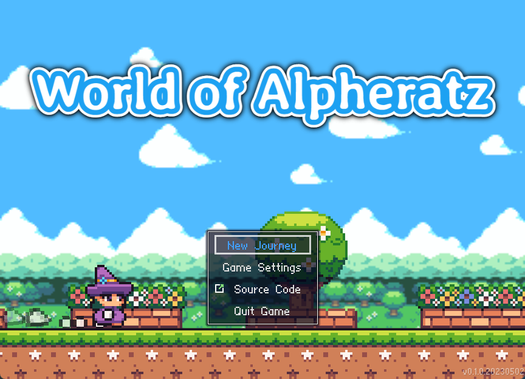
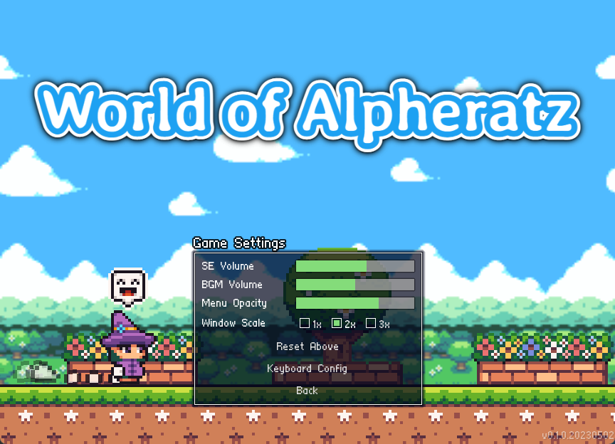
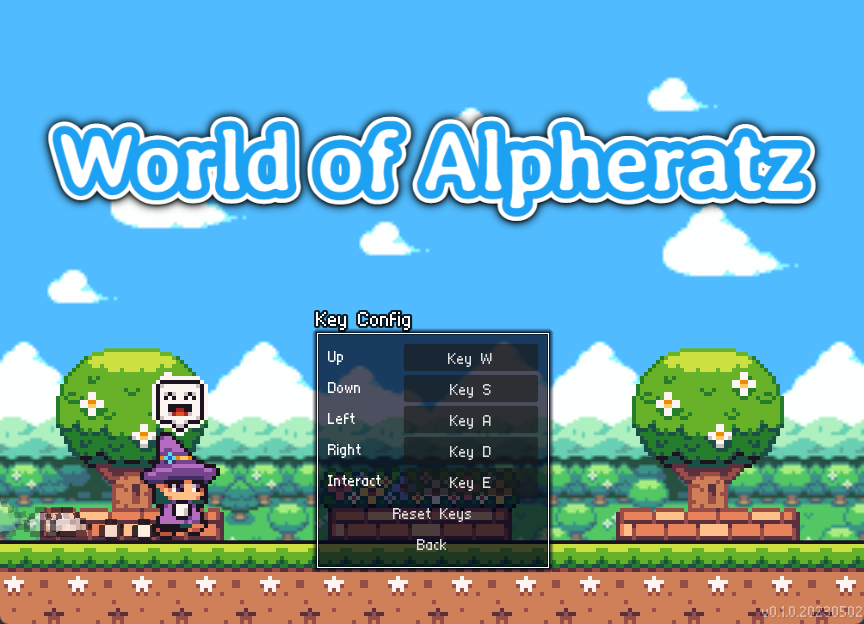
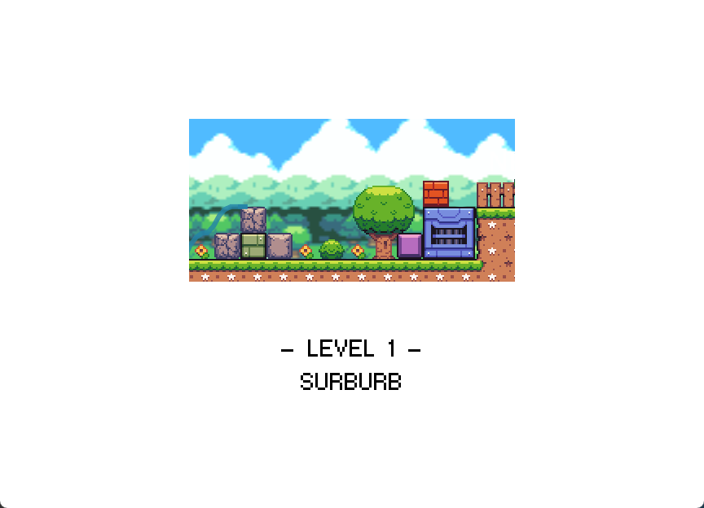
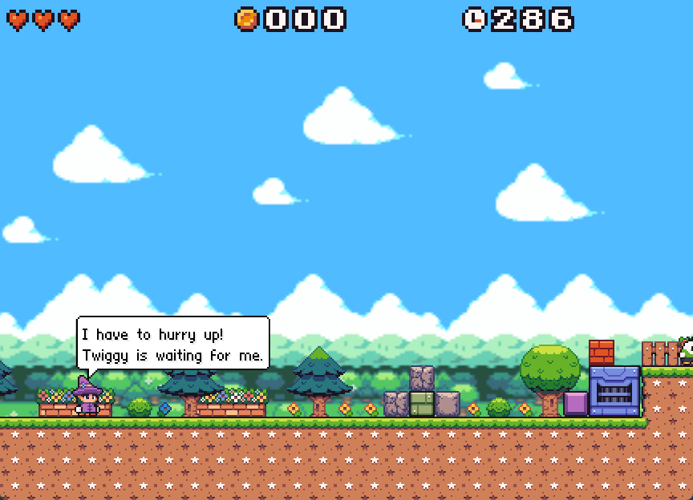
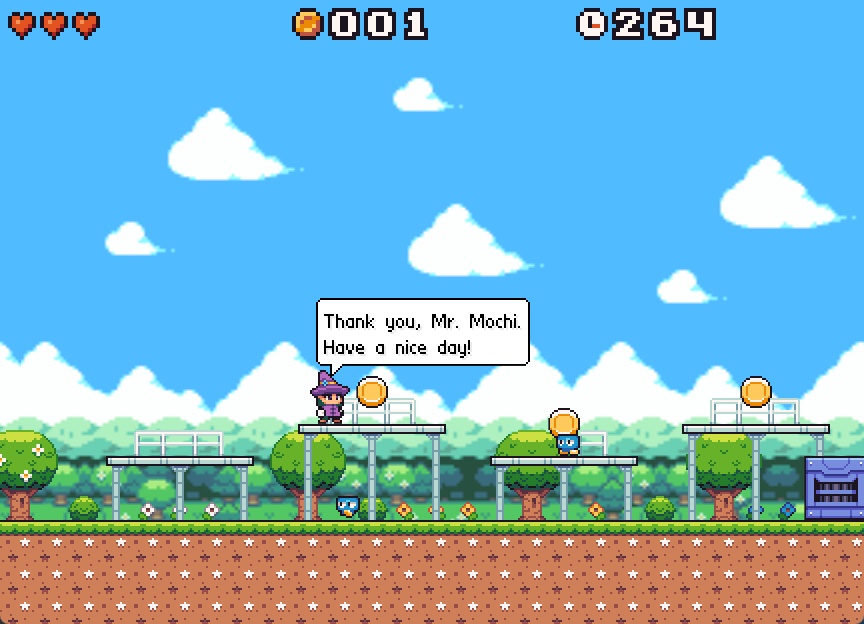
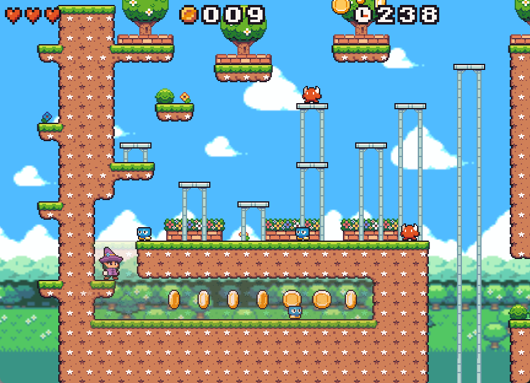

# Introduction

World of Alpheratz is a simple retro platformer demo game made with Godot 4.1 (.Net Version)

Currently it has only one level with basic mechanics, if you guys like it I will continue to develop it in my free time or contact me if you want to help me with the development (it will not be a commercial game).

The project (art is not inclueded, they have seperate licenses, see `assets_source.md`) is under MIT license, so you can use it as a base for your own game and I am glad if you do so.

# Preview

Youtube: https://www.youtube.com/watch?v=mqI4jX5b-ug&t=19s

or

Bilibili: https://www.bilibili.com/video/BV1Js4y1X7hp/#reply995671997

## Main Menu

https://user-images.githubusercontent.com/21126555/235853936-a1190c23-832c-4a3c-9264-dd36d4eb243e.mp4

## Gameplay

https://user-images.githubusercontent.com/21126555/235854053-f6de023a-ebc0-4e73-a78e-dc39fab672d6.mp4

https://user-images.githubusercontent.com/21126555/235854087-a8e421f9-46c2-4397-adb9-0e1acab71e0a.mp4

https://user-images.githubusercontent.com/21126555/235854115-d342f8c7-e78c-444e-b3dd-d393f9adb74b.mp4

